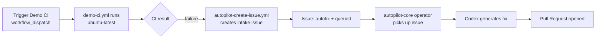

# autopilot-demo

[](https://github.com/Coding-Autopilot-System/autopilot-demo/actions/workflows/ci.yml)
[](https://github.com/Coding-Autopilot-System/autopilot-demo/actions/workflows/demo-ci.yml)
[](LICENSE)

**Demo target for the Coding-Autopilot-System AI repair pipeline** — triggers intake workflows when CI fails, demonstrating end-to-end agentic fix from failure detection to pull request.

Part of the [Coding-Autopilot-System](https://github.com/Coding-Autopilot-System) autonomous CI repair platform. The control plane lives in [autopilot-core](https://github.com/Coding-Autopilot-System/autopilot-core).

## How the demo works



1. Trigger `Demo CI` via `workflow_dispatch` to simulate a CI failure.
2. `autopilot-create-issue.yml` detects the failure and creates an issue labeled `autofix + queued`.
3. The [autopilot-core](https://github.com/Coding-Autopilot-System/autopilot-core) operator scans for the issue and invokes Codex.
4. Codex generates a targeted fix and opens a pull request in this repo.

## Running the demo

```bash
# Trigger the Demo CI workflow (simulates a failure)
gh workflow run demo-ci.yml -R Coding-Autopilot-System/autopilot-demo

# Watch for the intake issue to be created
gh issue list -R Coding-Autopilot-System/autopilot-demo --label autofix --label queued

# Monitor autopilot-core for the fix PR
gh pr list -R Coding-Autopilot-System/autopilot-demo
```

## Workflows

| Workflow | Purpose |
|----------|---------|
| `ci.yml` | Portfolio CI — YAML validation (always passes) |
| `demo-ci.yml` | Demo trigger — simulates CI activity to test intake flow |
| `autopilot-create-issue.yml` | Intake — creates autofix+queued issue on workflow failure |

## Documentation

- [Wiki](https://github.com/Coding-Autopilot-System/autopilot-demo/wiki) — setup guide, architecture, configuration reference
- [autopilot-core](https://github.com/Coding-Autopilot-System/autopilot-core) — operator control plane
- [Coding-Autopilot-System org](https://github.com/Coding-Autopilot-System)
