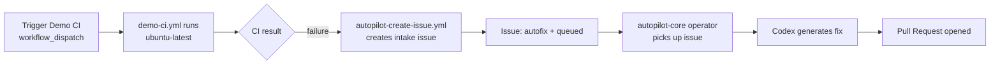

# autopilot-demo

[](https://github.com/Coding-Autopilot-System/autopilot-demo/actions/workflows/ci.yml)
[](https://github.com/Coding-Autopilot-System/autopilot-demo/actions/workflows/demo-ci.yml)
[](LICENSE)

**Demo target for the Coding-Autopilot-System AI repair pipeline** - triggers intake workflows when CI fails, demonstrating the end-to-end path from failure detection to pull request.

Part of the [Coding-Autopilot-System](https://github.com/Coding-Autopilot-System) autonomous CI repair platform. The control plane lives in [autopilot-core](https://github.com/Coding-Autopilot-System/autopilot-core), and the runner-hosted worker/runtime pattern lives in [ci-autopilot](https://github.com/Coding-Autopilot-System/ci-autopilot).

## Repo boundary

- `autopilot-demo` is not the operator and not the worker host. It is the demonstration target repo.
- `autopilot-core` owns queue scanning, Codex invocation, and PR creation.
- `ci-autopilot` shows the worker/runtime implementation used to process queued repair tasks.

## How the demo works



1. Trigger `Demo CI` via `workflow_dispatch` to simulate a CI failure.
2. `autopilot-create-issue.yml` detects the failure and creates an issue labeled `autofix + queued`.
3. The [autopilot-core](https://github.com/Coding-Autopilot-System/autopilot-core) operator scans for the issue and invokes Codex.
4. Codex generates a targeted fix and opens a pull request in this repo.

## Running the demo

```bash
# Trigger the Demo CI workflow (simulates a failure)
gh workflow run demo-ci.yml -R Coding-Autopilot-System/autopilot-demo

# Watch for the intake issue to be created
gh issue list -R Coding-Autopilot-System/autopilot-demo --label autofix --label queued

# Monitor autopilot-demo for the fix PR
gh pr list -R Coding-Autopilot-System/autopilot-demo
```

## Demo runbook

1. Trigger [`.github/workflows/demo-ci.yml`](.github/workflows/demo-ci.yml) with `simulate_failure=true` to produce a known failure signal. Pushes and default dispatches remain green.
2. Confirm [`.github/workflows/autopilot-create-issue.yml`](.github/workflows/autopilot-create-issue.yml) creates an `autofix + queued` issue.
3. Watch `autopilot-core` pick up the issue and open a PR back into this repo.
4. Use this repo's issue, branch, and PR history as the audit trail for the demo.

## Enterprise proof points

- Demonstrates bounded blast radius: the platform proposes a fix in a dedicated target repo before broader rollout.
- Produces an auditable story for reviewers: failure event, queued issue, operator pickup, and PR are visible artifacts.
- Keeps the demo reproducible with workflow-dispatch entry points rather than hidden local steps.

## Workflows

| Workflow | Purpose |
|----------|---------|
| `ci.yml` | Portfolio CI - YAML validation (always passes) |
| `demo-ci.yml` | Demo trigger - simulates CI activity to test intake flow |
| `autopilot-create-issue.yml` | Intake - creates `autofix + queued` issue on workflow failure |

## Documentation

- [Wiki](https://github.com/Coding-Autopilot-System/autopilot-demo/wiki) - setup guide, architecture, configuration reference
- [autopilot-core](https://github.com/Coding-Autopilot-System/autopilot-core) - operator control plane
- [ci-autopilot](https://github.com/Coding-Autopilot-System/ci-autopilot) - worker/runtime reference
- [Coding-Autopilot-System org](https://github.com/Coding-Autopilot-System)
## Prerequisites and expected result

- Authenticate GitHub CLI with `gh auth status` and confirm Actions are enabled for this repository.
- Run the `autopilot-core` operator with access to this repository before triggering the failure.
- Expect Demo CI to fail, Autopilot Issue Intake to create or reopen one `autofix + queued` issue, and the operator to propose a pull request.

## Reset and troubleshooting

1. Close the completed intake issue and merge or close its repair pull request before the next demonstration.
2. Re-run with `simulate_failure=true`; intake reopens the matching issue when the same commit is demonstrated again.
3. If no issue appears, inspect `gh run list -R Coding-Autopilot-System/autopilot-demo --workflow autopilot-create-issue.yml` and confirm the failed run was named `Demo CI`.
4. If the issue remains queued, verify the `autopilot-core` operator is running and can read issues and create branches and pull requests in this repository.
5. If CI fails before the demo step, run `python -m unittest discover -s tests -v` locally and repair the workflow contract violation first.
