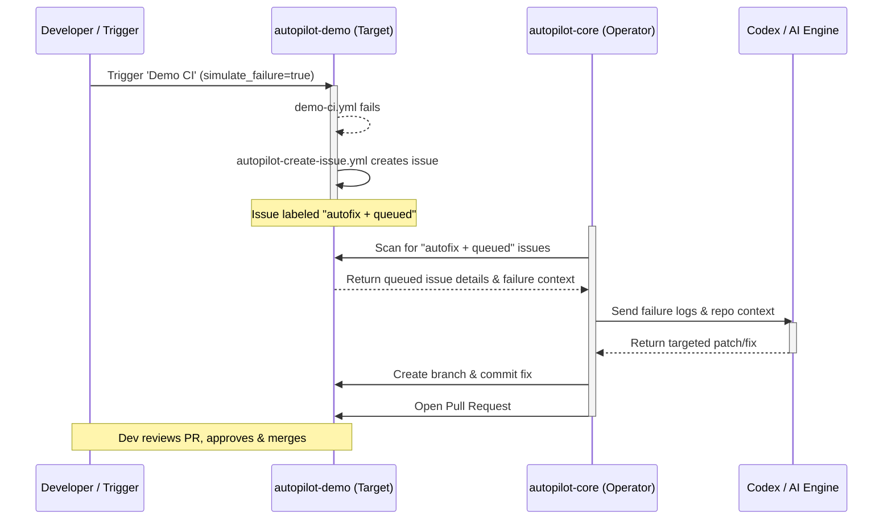

# Autopilot Demo - Architecture

The `autopilot-demo` repository is designed to integrate with the Coding-Autopilot-System (CAS) as a safe, isolated target for demonstrating automated code repair.

## End-to-End Workflow

The following diagram illustrates how a CI failure in this repository cascades through the CAS ecosystem to ultimately produce a generated fix.

## Workflow Components

1. **Failure Simulation**: We use `workflow_dispatch` on `demo-ci.yml` to explicitly trigger a failure. This avoids polluting normal commits with red builds while keeping the demo reproducible.
2. **Issue Intake**: The `autopilot-create-issue.yml` workflow listens for the failure. It acts as the bridge between the CI run and the asynchronous repair queue, converting a failed run into an actionable GitHub Issue.
3. **Operator Control Plane**: The `autopilot-core` operator is external to this repository. It polls for the intake signal, gathers context, and invokes the underlying AI model.
4. **Resolution**: Once the AI generates a fix, the operator pushes a branch and opens a Pull Request directly back into `autopilot-demo` for human review.
