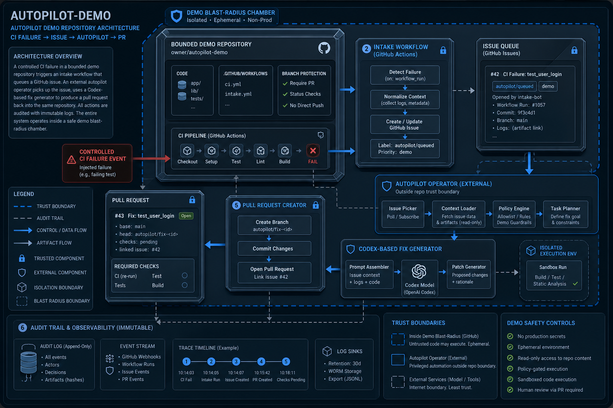
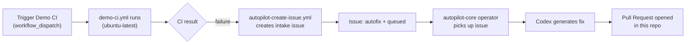

# Architecture

`autopilot-demo` exists only to make the CAS autofix loop observable end to end. It is not the
operator and not the worker host — it is a bounded-blast-radius target that produces a public,
inspectable audit trail (failure event, queued issue, operator pickup, PR).

<!-- codex:generate-image prompt="A single glass test chamber on a factory floor with a red failure light, a robotic arm reaches in, tags the chamber with a queued ticket, then a second arm delivers a wrapped package labeled Pull Request; isometric, enterprise blue/graphite palette" style="isometric, enterprise, clean" replaces="mermaid-above" -->

## Repo boundary

- `autopilot-demo` is not the operator and not the worker host. It is the demonstration target.
- `autopilot-core` owns queue scanning, Codex invocation, and PR creation.
- `ci-autopilot` shows the worker/runtime implementation used to process queued repair tasks.

## Trust boundaries

- The demo's own CI (`ci.yml`) always passes — only `demo-ci.yml` is used to simulate a
  controlled failure signal, keeping normal push/PR checks green.
- The intake path (`autopilot-create-issue.yml`) only creates issues; it never mutates code.
- All repair mutation happens through a PR opened by `autopilot-core`, reviewed like any other
  change — no direct push to `main` from the automation path.

<!-- docs-verified: ec62179aa2c20bc731542de4ac3fec9cc94a831d 2026-07-08 -->
